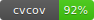

# 2017VisionCode
Finally working... 9 weeks after the season ended :expressionless:



The server uses ZeroMQ to communicate with any client.

Start the server:

```bash
python server.py
```

The client communicates with the server using ZeroMQ for < 0.9ms response times.

Start the client:

```bash
python client.py
```

To test any modifications to the algorithm before pushing, run the test script:

```bash
python coverage.py
```

The final goal is to have all 56 images covered by the algorithm defined in `Pipeline.py`.
